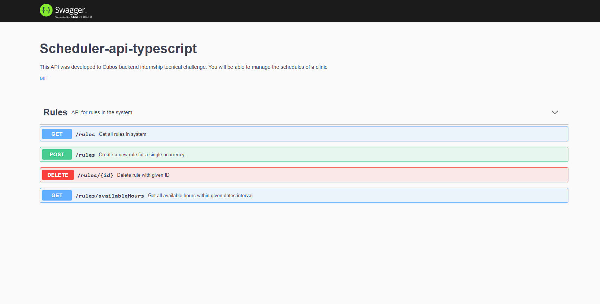
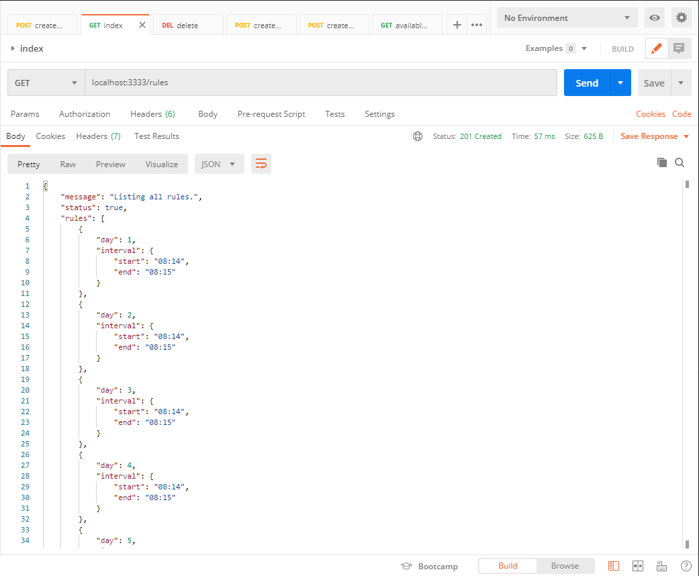
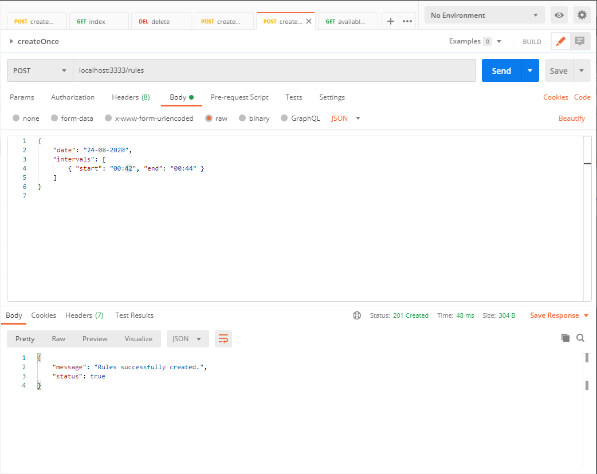
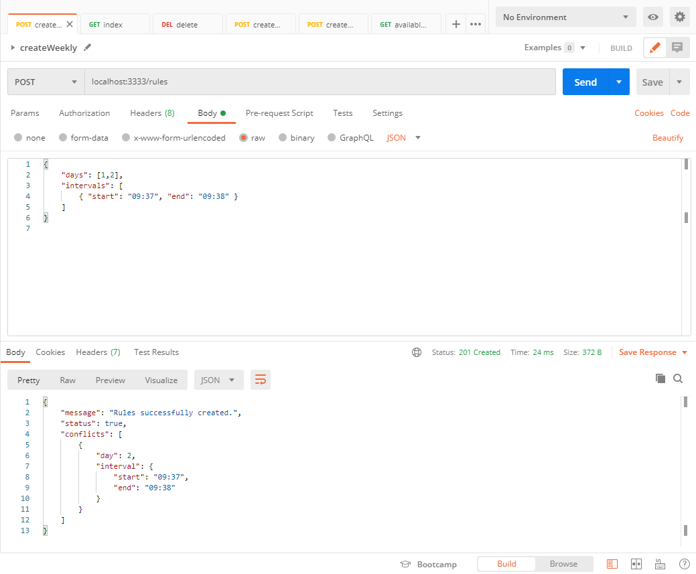
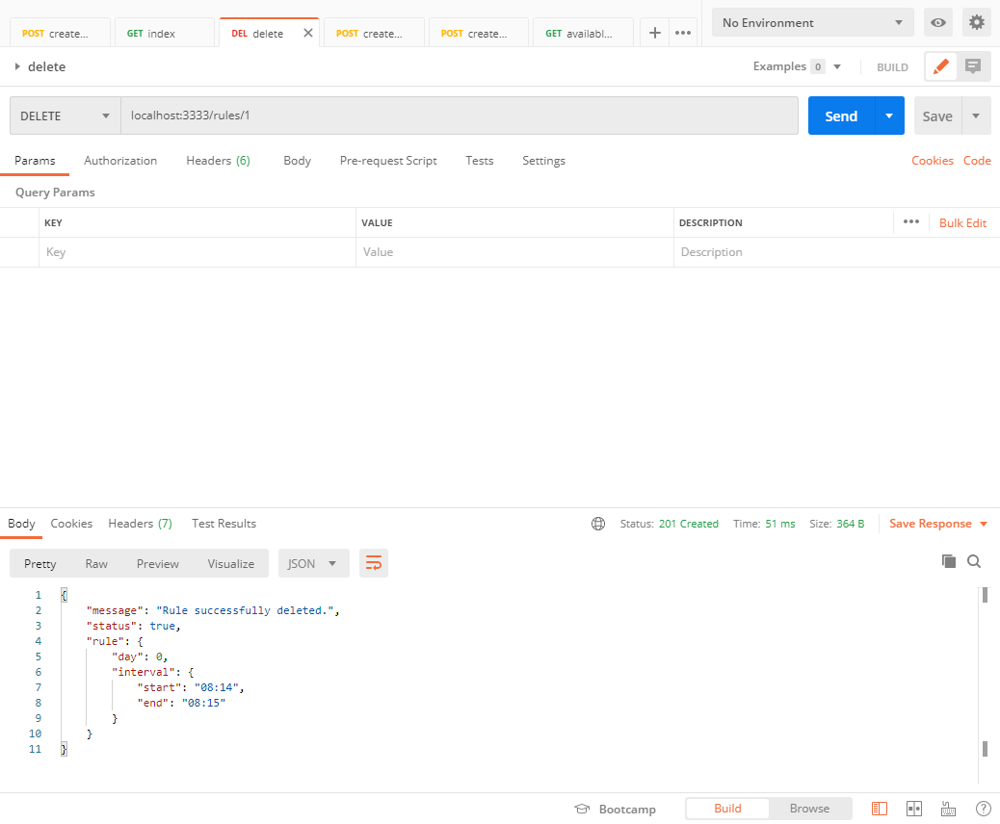

# Scheduler API-REST

This API was developed to Cubos backend internship tecnical challenge. You will be able to manage the schedules of a clinic.

## Getting Started

These instructions will get you a copy of the project up and running on your local machine for development and testing purposes. 

### Prerequisites

To run this application you need npm and NodeJs installed on your computer.
If you don't have it, just go install them following the links below:
```
https://docs.npmjs.com/cli/install
https://nodejs.org/en/download/
```
### Installing

Lets get you prepared to use this API.

Install all dependencies:
```
npm install
```

Ok, you are ready to test this application.
Just run
```
npm run start
```  
and enjoy it! :)

### Development with nodemon and tsc --watch

```bash
npm run dev
```

### Run without nodemon and tsc --watch

```bash
npm start
```

## Swagger

Visit `http://localhost:3333/swagger` to view the OPENAPI document in Swagger-UI


### Usage

I assume you're using Postman to test this API. If not, just go to https://www.getpostman.com/downloads/ and start using. :)

## Routes & Endpoints
|Method  | Route | Endpoint  
|--|--|--|
| GET |/post  | index
| POST |/post  | create
| DELETE |/post  | delete
| GET |/post  | availableHours

### index

This endpoint lists all created rules

### create
This endpoint allows you to choose any date with format DD-MM-YYYY, any week day, as number, and interval objects, wich of this elements following the structures below. 
```
{
	"date": "DD-MM-YYYY",
	"days": [0: "Sunday", 1: "Monday", 2: "Tuesday", 3: "Wednesday", 4: "Thursday, 5: "Friday", 6: "Saturday"],
	"intervals": [{ start: "10:40", end: "11:00" }, { start: "15:00", end: "15:30" }]
}
```
There is three possible uses of this structure: 

One specific day:
```
{
    "date": "23-08-2020",
    "intervals": [{"start": "10:00", "end": "15:00"}],
}
```

Daily:
```
{
    "intervals": [{"start": "11:00", "end": "15:00"}],
}
```

Weekly:
```
{
    "days": [0, 1, 2],
    "intervals": [{"start": "10:00", "end": "15:00"}],
}
```
There is validation to ensure time conflict with already created rules.
For example, using the examples above, if we try to create a daily rule, every monday and saturday, starting "09:30 and ending "10:50", the only one created will be saturday, as we have a conflict between the already created rules and our new intervals in monday.

If there is any time conflicts, the rules will be listed in response.

Possible status are:
```
200 - There were conflicts with some of the given rules; 
201 - All rules were successfully created;
400 - Something went wrong with the request;
```
 
### delete

This method receives the id of a created Rule, get the rule in JSON file named rules.json and delete it.
The id is passed through the URL. For example: localhost:3333/rules/9

Possible status are:
```
200 - The rule was successfully delete;
400 - Something went wrong with the request;
500 - There is no rule with this id;
```

### available

This method receives the two dates with format "DD-MM-YYYY" and returns all available intervals between these dates considering all created rules.
Both dates should be passed as query parameters with keys "firstDay" and "lastDay". 

Possible status are:
```
200 - OK - Lists all availables hours;
400 - Something went wrong with the request;
500 - Missing query parameters;
```
## Tests

There is a few tests to ensure all the proper functioning of the functions. All tests can be found in `/src/tests/controller.spec.ts`

### Support files
To test the application were created a fake controller to simulate the real Controller.

## Collection
There is a collection in postman to test index, create, delete and available endpoints. Feel free to test it. <br>
Link: https://www.getpostman.com/collections/e7a5d0d91c0d38abbfd8

That's all, folks!